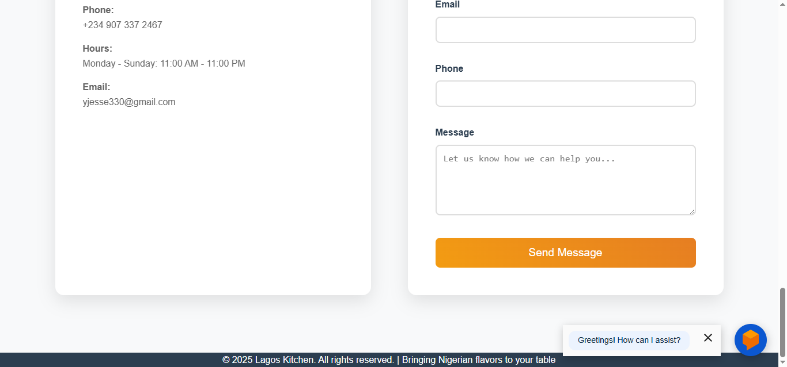
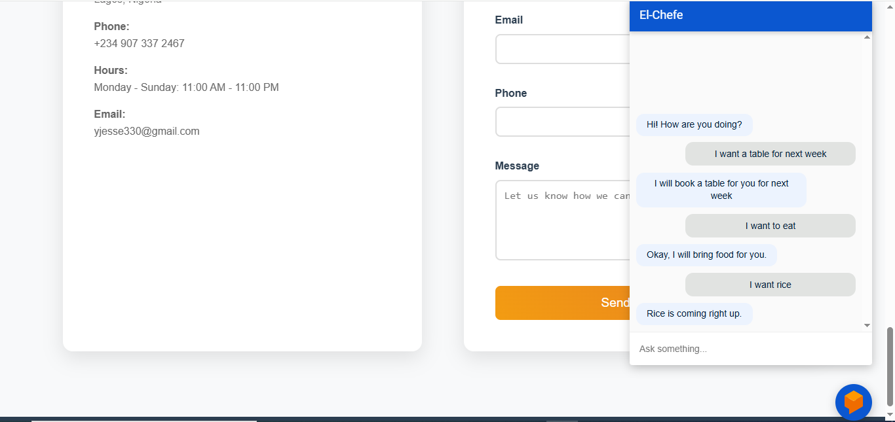

# Restaurant Customer Support Chatbot

A conversational AI chatbot built with Google Dialogflow for restaurant customer support, handling table bookings, food ordering, and general inquiries.

## Project Overview

This chatbot serves as a virtual assistant for restaurant customers, providing 24/7 support for common tasks like table reservations, menu inquiries, and food ordering. Built as part of the Future Interns Machine Learning Task 3.

## Features

- **Table Booking System**: Customers can book tables with automatic date recognition
- **Welcome & Greeting**: Friendly welcome messages for new customers
- **Menu Inquiry**: Check food availability from the restaurant's menu
- **Food Ordering**: Place orders for available items
- **Smart Fallback**: Handles unrecognized queries with helpful fallback responses
- **Natural Language Processing**: Understands various ways customers phrase their requests

## Technology Stack

- **Platform**: Google Dialogflow
- **NLP Engine**: Dialogflow's built-in natural language understanding
- **Entities**: Custom and system entities for data extraction

## Chatbot Architecture

### Intents Created

#### 1. **Table Booking Intent**
- **Purpose**: Handle table reservation requests
- **Entities Used**: System date entity (`@sys.date`)
- **Sample Training Phrases**:
  - "I want to book a table for tonight"
  - "Can I reserve a table for tomorrow?"
  - "Book a table for [date]"
- **Response**: Confirms booking with date and provides next steps

#### 2. **Welcome Intent**
- **Purpose**: Greet customers and introduce the chatbot
- **Trigger**: Initial conversation start, greetings
- **Sample Training Phrases**:
  - "Hello"
  - "Hi there"
  - "Good morning"
- **Response**: Friendly greeting and menu of available services

#### 3. **Food Availability Intent**
- **Purpose**: Check if requested food items are available
- **Entities Used**: Custom entity `@food_list`
- **Sample Training Phrases**:
  - "Do you have [food-item]?"
  - "Is [food-item] available?"
  - "What's on the menu?"
- **Response**: Confirms availability or suggests alternatives

### Custom Entities

#### `@food_list` Entity
Contains all available food items in the restaurant menu:
- Rice
- Beans
- Egusi
- Fufu
- Bread
- Chicken
- Fish

### System Entities Used
- `@sys.date`: For capturing dates in table booking requests

## Implementation Details

### Training Data
### Response Design
- **Conversational Tone**: Friendly and professional responses
- **Dynamic Responses**: Multiple response variations to avoid repetition
- **Context Awareness**: Responses reference extracted information (dates, food items)

### Fallback Handling
- **Default Fallback Intent**: Activated when user input doesn't match any trained intent
- **Helpful Responses**: Guides users back to supported functions

## Screenshots

## Future Enhancements

### Potential Improvements
- **Order Management**: Track and manage complete orders
- **Payment Integration**: Connect with payment processing systems
- **Location Services**: Multiple restaurant locations support
- **Personalization**: Remember customer preferences
- **Rich Responses**: Add images, cards, and quick replies
- **Voice Support**: Enable voice interactions

### Integration Possibilities
- **Website Integration**: Embed on restaurant website
- **Messaging Platforms**: Deploy to WhatsApp, Telegram, Facebook Messenger
- **Mobile App**: Integrate with restaurant mobile application
- **Third-party Services**: Connect with reservation systems, POS systems

## Learning Outcomes

Through this project, I gained hands-on experience with:
- **Conversational AI Design**: Understanding user intent and conversation flow
- **NLP Concepts**: Entity extraction, intent recognition, and context management
- **Dialogflow Platform**: Navigation, agent creation, and testing
- **Customer Service Automation**: Designing for real-world business needs
- **No-Code Development**: Building functional AI applications without programming

## Project Metrics

- **Intents Created**: 4 custom intents + 1 fallback
- **Training Phrases**: 15+ diverse training examples
- **Custom Entities**: 1 comprehensive food menu entity
- **System Entitie**: 1 System Entity (date)
- **Response Variations**: Multiple responses per intent for natural conversation

## Acknowledgments

- **Future Interns**: For providing the learning opportunity and project structure
- **Google Dialogflow**: For the powerful no-code chatbot development platform
- **Community Resources**: YouTube tutorials and documentation that guided development